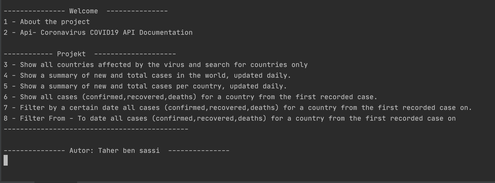

# haskell-corona-app


* Coronavirus disease (COVID-19) is an infectious disease caused by a newly discovered coronavirus.
  
  Most people infected with the COVID-19 virus will experience mild to moderate respiratory illness and recover without requiring special treatment.  Older people, and those with underlying medical problems like cardiovascular disease, diabetes, chronic respiratory disease, and cancer are more likely to develop serious illness.
  The best way to prevent and slow down transmission is be well informed about the COVID-19 virus, the disease it causes and how it spreads. Protect yourself and others from infection by washing your hands or using an alcohol based rub frequently and not touching your face.
  The COVID-19 virus spreads primarily through droplets of saliva or discharge from the nose when an infected person coughs or sneezes, so it’s important that you also practice respiratory etiquette (for example, by coughing into a flexed elbow).
  At this time, there are no specific vaccines or treatments for COVID-19. However, there are many ongoing clinical trials evaluating potential treatments. WHO will continue to provide updated information as soon as clinical findings become available.
  
  Source: https://www.who.int/health-topics/coronavirus#tab=tab_1
  
* With this project we provide all the information about corona this Api : 

[Coronavirus COVID19 API] (https://documenter.getpostman.com/view/10808728/SzS8rjbc?version=latest) 


### Familiar with Git?

clone this repository 

```
git clone https://github.com/taherbensassi/corona-haskell.git
```

### Not familiar with Git?

- <a href="https://github.com/taherbensassi/corona-haskell.git">Download ZIP</a>
- extract the contents of the zip file
- and `cd` into `corona-haskell` folder `cd corona-haskell`


### Install dependencies

###### Install with stack [stack](https://docs.haskellstack.org/en/stable/README/)

```
stack install
```

### Start 

```
stack run
```


### Screenshot

<table width="100%" border="0">
  <tr>    
  <td>    </td>
  </tr>
</table>

## Author

[Taher Ben Sassi](mailto:taher.sassi.isamm@gmail.com)


###### !!! Beginner lvl in Haskell, so i would be happy to get any feedback for improvement  


